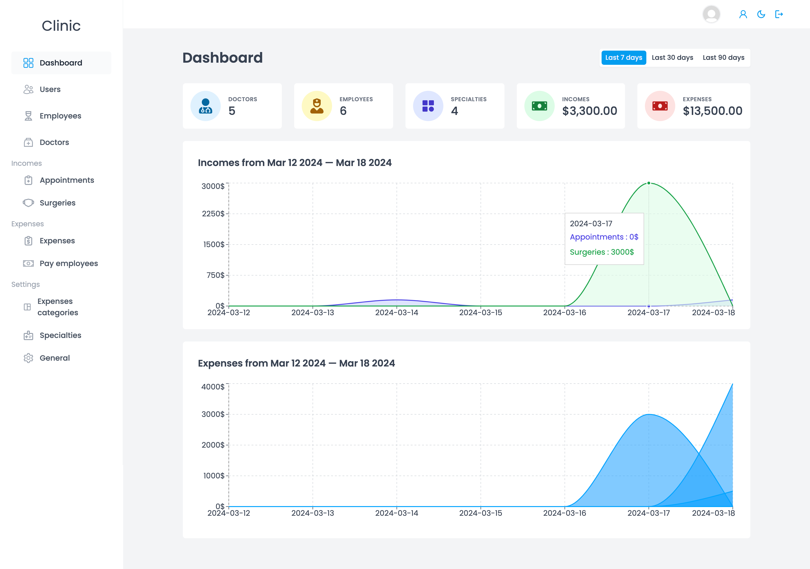
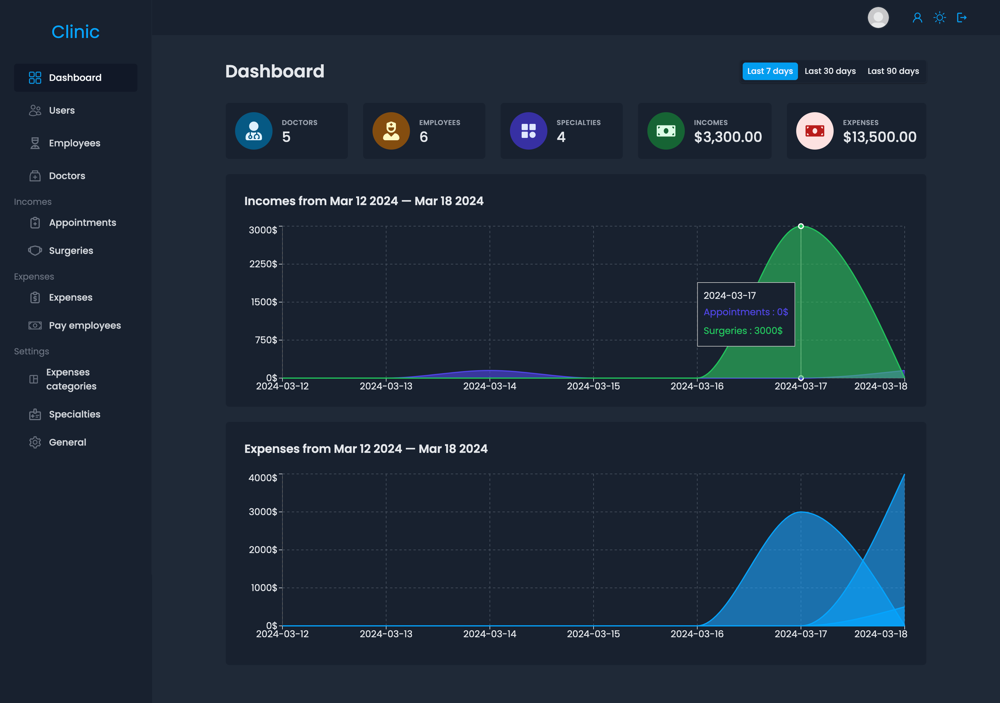
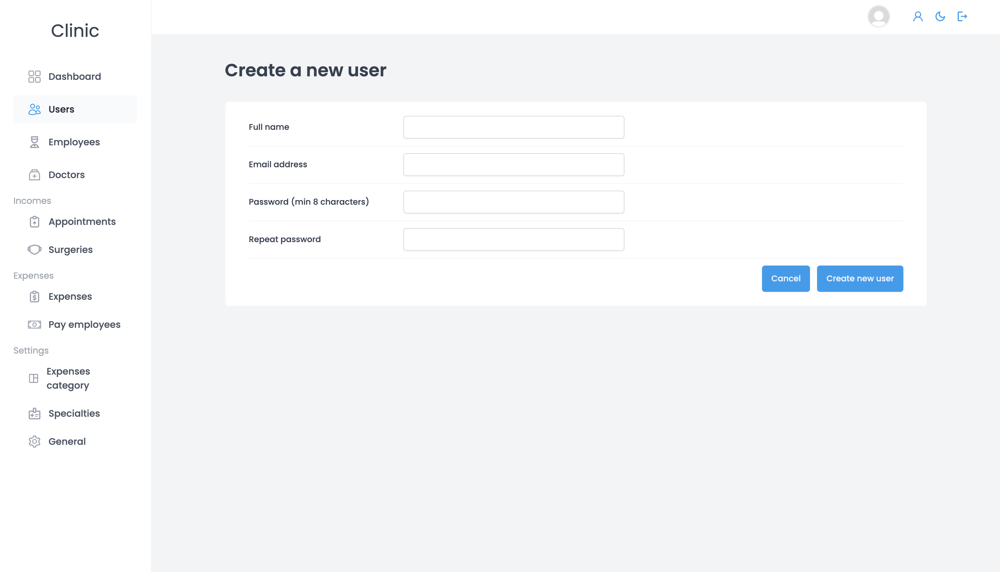

# Clinic Management System

The Clinic Management System is a comprehensive web-based platform designed to streamline the administrative and operational tasks of a medical clinic. It provides a centralized solution for managing employees, doctors, appointments, surgeries, incomes, expenses, expenses categories, specialties, settings, and a dynamic dashboard. With intuitive user interfaces and robust functionalities, the system empowers clinic administrators to efficiently organize clinic operations, enhance patient care, and optimize financial management.

## Screenshots

## Key Features:

- **Employee Management:** Track employee details, roles, schedules, and payments.
- **Doctor Management:** Manage doctor profiles, specialties, schedules, and contact information.
- **Appointment Management:** Schedule, update, and track patient appointments with assigned doctors.
- **Surgery Management:** Record and track surgical procedures, including type, cost, and date.
- **Income Management:** Monitor revenues generated from appointments and surgeries.
- **Expense Management:** Categorize and track clinic expenses, including maintenance, supplies, and medicines.
- **Payment to Employees:** Process payments to employees with detailed records of amounts and dates.
- **Expenses Categories Management:** Define and manage categories for organizing clinic expenses.
- **Specialty Management:** Assign doctors to specific medical specialties for efficient patient care.
- **Settings:** Define net prices for day and night appointments to manage differential pricing effectively.
- **Dashboard:** View key metrics and performance indicators for the clinic, including summaries for the last 7 days, last 30 days, and last 90 days. The dashboard provides insights into the number of doctors, employees, specialties, total incomes, total expenses, and graphical representations of income and expense trends over specific periods.
- **Dark Theme:** Enhance user experience with a dark theme option, providing a visually appealing and comfortable interface for users who prefer reduced eye strain and a modern aesthetic.

## Additional Features:

- **Net Price Configuration:** Define net prices for day and night appointments separately in the settings. This feature allows the clinic to manage differential pricing based on the time of the appointment. The net price accounts for the clinic's gain only, excluding the doctor's share of the appointment fee.

## Technologies Used:

- **React Query:** Utilized for state management, React Query offers an efficient and straightforward approach to managing state in React applications. It simplifies data fetching, caching, and synchronization with the server, enhancing the performance and scalability of the Clinic Management System.
- **React:** The Clinic Management System is built using React, a popular JavaScript library for building user interfaces. React provides a component-based architecture and declarative syntax, enabling developers to create interactive and reusable UI components efficiently.
- **JavaScript:** The primary programming language used for client-side development.
- **Supabase:** Leveraged for backend services and database management, Supabase is an open-source Firebase alternative built on top of PostgreSQL. It offers authentication, real-time database, and serverless functions, allowing seamless integration with React applications and efficient data storage and retrieval for the Clinic Management System.

## Purpose:

The Clinic Management System aims to streamline administrative processes, improve clinic efficiency, and enhance the overall patient experience. By providing a centralized platform for managing clinic operations, the system enables administrators to focus on delivering high-quality healthcare services while ensuring effective resource management and financial stability.

## Target Audience:

Clinic administrators, healthcare professionals, and staff members responsible for managing clinic operations, appointments, finances, and employee-related tasks.

## Benefits:

- Centralized management of clinic operations and resources.
- Improved scheduling and coordination of patient appointments and surgeries.
- Enhanced financial management with detailed tracking of incomes and expenses.
- Streamlined employee management and payroll processing.
- Optimized patient care through specialty-based assignment of doctors and efficient resource allocation.
